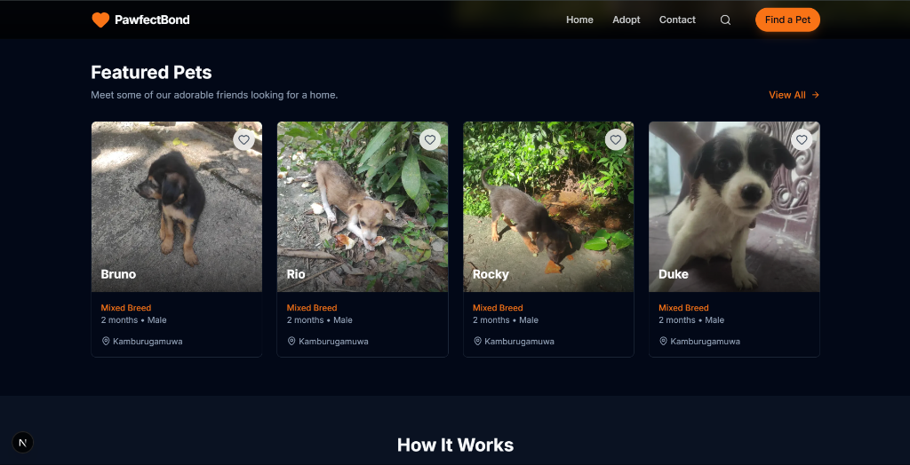

# 🐾 PawfectBond

<div align="center">
  
  
  <br />
  
  <h3>Connect with your new best friend today!</h3>
  
  [**Visit Live Site**](https://pawfectbond.netlify.app/)
</div>

<br />

## 📖 About

**PawfectBond** is a modern pet adoption platform designed to connect loving homes with animals in need. Our mission is to streamline the adoption process, making it easier for potential adopters to find their perfect match while helping shelters and rescuers showcase their animals effectively.

## ✨ Features

- **Browse Pets:** View a gallery of available dogs and cats with detailed profiles.
- **Search & Filter:** Easily find pets by name, breed, or location.
- **Responsive Design:** A seamless experience across all devices (Mobile, Tablet, Desktop).
- **Direct Contact:** Connect directly with shelters or rescuers via WhatsApp or Phone.
- **Modern UI:** A clean, intuitive, and visually appealing interface.

## 🛠️ Tech Stack

- **Framework:** [Next.js 15](https://nextjs.org/) (App Router)
- **Language:** [TypeScript](https://www.typescriptlang.org/)
- **Styling:** [Tailwind CSS](https://tailwindcss.com/)
- **Icons:** [Lucide React](https://lucide.dev/)
- **Deployment:** [Netlify](https://www.netlify.com/)

## 🚀 Getting Started

First, run the development server:

```bash
npm run dev
# or
yarn dev
# or
pnpm dev
# or
bun dev
```

Open [http://localhost:3000](http://localhost:3000) with your browser to see the result.

You can start editing the page by modifying `app/page.tsx`. The page auto-updates as you edit the file.

## 🤝 Contributing

We welcome contributions to make PawfectBond even better!

1.  **Fork** the repository.
2.  Create a new **Branch** (`git checkout -b feature/AmazingFeature`).
3.  **Commit** your changes (`git commit -m 'Add some AmazingFeature'`).
4.  **Push** to the branch (`git push origin feature/AmazingFeature`).
5.  Open a **Pull Request**.

## 📄 License

This project is open source and available under the [MIT License](LICENSE).

---

<div align="center">
  Made with ❤️ for animals by <a href="https://github.com/Sachindu-Nethmin">Sachindu Nethmin</a>
</div>
